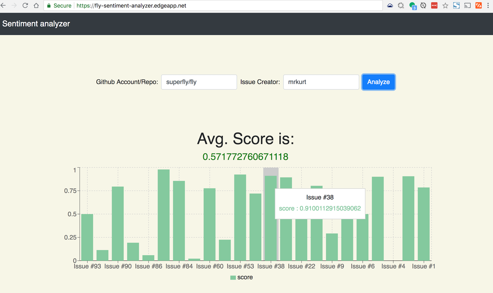
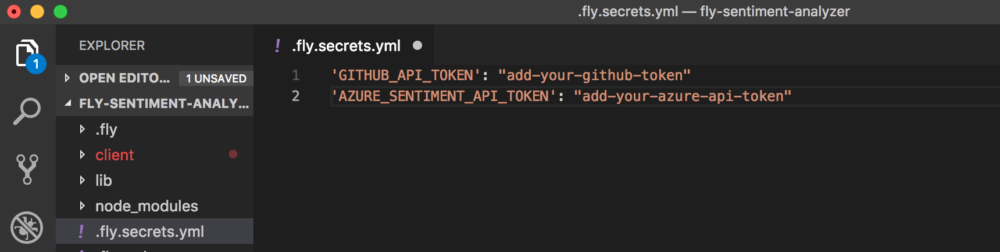
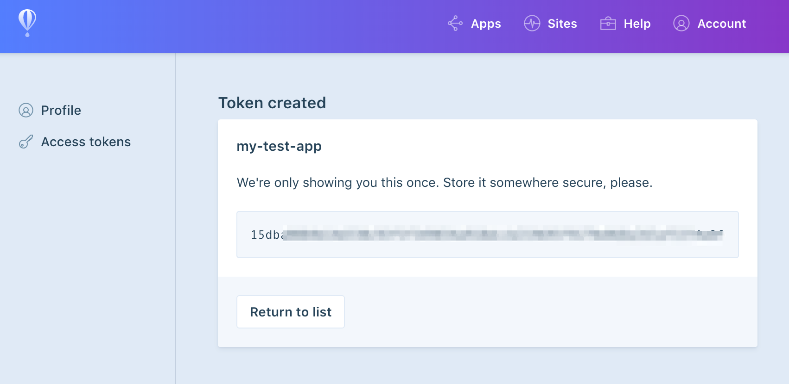

# 📊Sentiment Analyzer
This app runs on superfast fly.io's edge servers and shows overall sentiment of a Github user who has opened one of more issues on a Repo. 



#### Here is how it works:

1. This receives Github repo and a user info from a React client.
2. Calls Github's GraphQL to get issues reported by a given user.
3. Calls Microsoft Azure to get sentiment of each issue
5. Combines both the Github issues and the sentiment score and returns to the React client.
5. Finally the React client displays a graph and score on the React client.


## Live App

Live app is running on fly.io's edge servers here:
https://fly-sentiment-analyzer.edgeapp.net/

# Installation

This repo has both the fly.io's server and React client (in /client). Below are the steps to install and run both of them.

1. `npm install -g @fly/fly`
2. Create `.fly.secrets.yml` file on the root
3. Add `GITHUB_API_TOKEN` and `AZURE_SENTIMENT_API_TOKEN` into the `.fly.secrets.yml` file

    3.1 `GITHUB_API_TOKEN` is the Github's personal access token. You can get one <a href="https://help.github.com/articles/creating-a-personal-access-token-for-the-command-line/" target="_blank" > from here</a>.
 
    3.2 `AZURE_SENTIMENT_API_TOKEN` is Azure cloud's API. You need to go <a href="https://azure.microsoft.com/en-us/services/cognitive-services/text-analytics/?v=18.05" target="_blank" >here</a>, sign up and select the free option. Once inside, search for **Text Analytics** and enter some dummy info to setup a service.

    3.3 The picture below shows how it should look like.
    
4. Add the same keys into `.fly.yml` like the following. This is the file where all the configs are loaded into the app. Note: This is already added for you.

    ```
    GITHUB_API_TOKEN:
        fromSecret: GITHUB_API_TOKEN
    AZURE_SENTIMENT_API_TOKEN:
        fromSecret: AZURE_SENTIMENT_API_TOKEN
    ```    
5. Update `AZURE_API_URL` to math your Azure's API endpoint. I had selected **US West 2** location, so the Azure's location has: `westus2`. Your's may be different.

6. Set `FLY_ACCESS_TOKEN` for the CLI

    6.1 Create a <a href="https://fly.io/app/sign-up" target="_blank"> fly.io account</a>

    6.2 Go to `Accounts | Settings | Access tokens`

    6.3 Click on `Create access token` and enter some useful name like your app's name.

    6.4 Copy the accesstoken
    
    6.5 Set the access token to environment variable `export FLY_ACCESS_TOKEN=<your-token>`
    

# Running locally
After all the installation work, do the following:

1. Run `fly server`
2. Open `localhost:3000`

# Running on fly.io's edge servers
After all the installation work, do the following:

1. Run `fly login` and login from the command line
2. Run `fly apps create <app-name>`. Replace `<app-name>` with some unique name for your app.
3. Update the app name in `.fly.yml` file's `app`
4. Run `fly deploy` to deploy the app
5. Run `fly secrets set GITHUB_API_TOKEN <your token>` to set Github's token
6. Run `fly secrets set AZURE_SENTIMENT_API_TOKEN <your azure token>` to set Azure's token
7. Your app should be running at `https://<your-app-name>.edgeapp.net/`


# React client 
**Read this section only if you plan to update the React client.**

The client is inside `/client` folder. If you want to make changes, it's based on `create-react-app`.
To run it locally do the following:

1. `cd /client`
2. `npm install`
3. `npm start` 
4. The React dev server should start at port `3001`.

Notes:
The `/client/package.json` file of the React app has two changes.

1. It uses port `3001` because fly.io defaults to `3000. `"start": "PORT=3001 react-scripts start",` 

2. It proxys AJAX requests from the React client to port `3000` so it can talk to the server. `"proxy": "http://localhost:3000"`

### Updating React App to fly.io
After you are done making changes to the client app, do the following:

1.  Make sure to run `npm run build` to build a production version.

2. Don't forget to update the newer versions of the JS, CSS files in `.fly.yml`. Currently the fly server needs us to manually add all the individual files that are part of the React production app into `.fly.yml`.
3. The following shows the list of files that are being served in the current production app.

```
    files:
        - client/build/index.html
        - client/build/static/js/main.82baf497.js
        - client/build/static/js/main.82baf497.js.map
        - client/build/static/css/main.e1ef031f.css
        - client/build/static/css/main.e1ef031f.css.map
        - client/build/asset-manifest.json
        - client/build/favicon.ico
        - client/build/manifest.json
        - client/build/service-worker.js
```


# License
MIT
